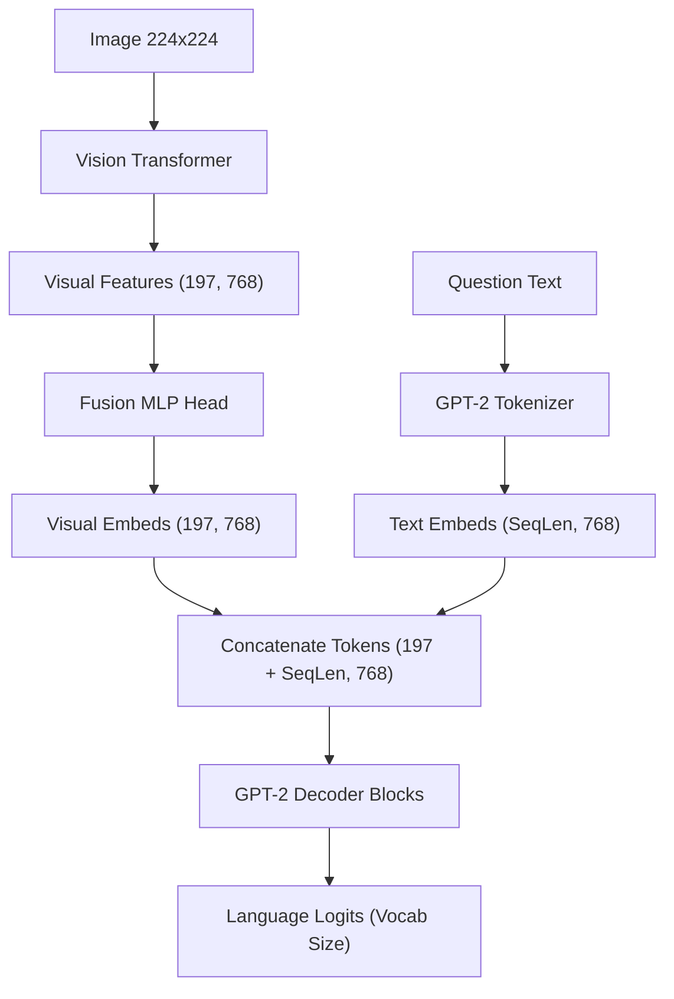

# Modern Visual Question Answering (VQA) System: ViT + LLM (Fusion Head)

This project implements a state-of-the-art **Visual Question Answering (VQA)** model using a Vision Transformer (ViT) and a decoder-only Large Language Model (GPT-2/DistilGPT-2) connected via a custom **Fusion Projection Head**.

By projecting visual features directly into the text embedding space of the LLM, the model learns to "read" images as if they were a series of prefix word tokens, allowing the language model to answer questions about the image content.

---

## Architecture Diagram



### Components:
1. **Vision Encoder**: Pre-trained `google/vit-base-patch16-224` which extracts a representation of sequence length 197 (1 CLS token + 196 patch tokens) with a hidden dimension of 768.
2. **Fusion Projection Head**: A multi-layer perceptron (MLP) mapping 768-dim visual features to 768-dim GPT-2 token embeddings.
3. **Language Decoder**: Pre-trained `distilgpt2` acting as the autoregressive generator.
4. **Loss Masking**: Cross-entropy language modeling loss is applied **only** on the answer tokens by setting visual tokens and prompt question tokens to `-100` (`ignore_index`).

---

## File Structure

- [environment.yml](file:///Users/abdullahsaeed/Documents/Computer%20Vision%20Projects/29%20-%20Visual%20Question%20Answering%20System/environment.yml) - Conda environment configuration.
- [model.py](file:///Users/abdullahsaeed/Documents/Computer%20Vision%20Projects/29%20-%20Visual%20Question%20Answering%20System/model.py) - PyTorch implementation of the VQA fusion model.
- [dataset.py](file:///Users/abdullahsaeed/Documents/Computer%20Vision%20Projects/29%20-%20Visual%20Question%20Answering%20System/dataset.py) - Synthetic shapes dataset generator and PyTorch dataset loader.
- [train.py](file:///Users/abdullahsaeed/Documents/Computer%20Vision%20Projects/29%20-%20Visual%20Question%20Answering%20System/train.py) - PyTorch model training and validation script.
- [app.py](file:///Users/abdullahsaeed/Documents/Computer%20Vision%20Projects/29%20-%20Visual%20Question%20Answering%20System/app.py) - High-quality interactive Streamlit application.

---

## Installation & Setup

1. **Create and Activate Conda Environment:**
   If you want to set up the environment from scratch:
   ```bash
   conda env create -f environment.yml
   conda activate vit_env
   ```
   *Note: If you already have `vit_env` active, the packages `transformers` and `datasets` have already been pre-installed for you.*

2. **Verify PyTorch MPS Support (on macOS):**
   ```bash
   python -c "import torch; print('MPS is available:', torch.backends.mps.is_available())"
   ```

---

## How to Use

### Option 1: Start the Interactive Web Dashboard (Recommended)

Run the Streamlit application to explore the synthetic dataset, train the model interactively (viewing live loss curves), and test custom image/question inferences:

```bash
streamlit run app.py
```

### Option 2: Train via Command Line

Run the PyTorch training pipeline on the CLI:

```bash
python train.py --epochs 5 --batch_size 16 --lr 1e-3
```

Parameters:
- `--epochs`: Number of training epochs (default: 5)
- `--batch_size`: Batch size (default: 16)
- `--lr`: Learning rate (default: 1e-3)
- `--train_size`: Size of synthetic training dataset (default: 400)
- `--val_size`: Size of validation dataset (default: 100)
- `--save_path`: Output checkpoint filename (default: `vqa_fusion_model.pt`)
- `--unfreeze_llm`: Set this flag to unfreeze and fine-tune GPT-2 parameters (default: frozen).
